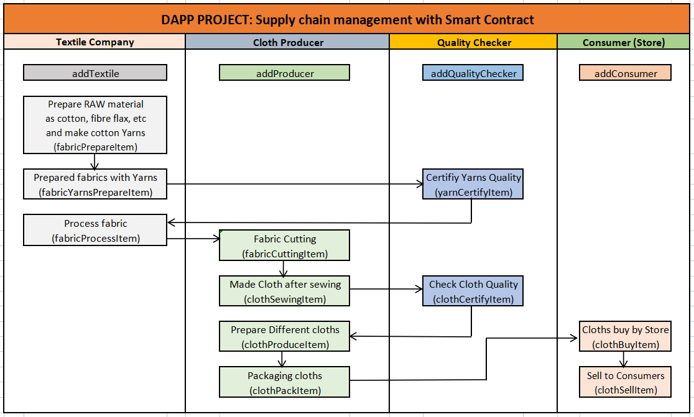

**# DAPP PROJECT: Supply chain management with Smart Contract**

By using **smart contracts**, this project will overcome supply chain management issues related to traceability, so I created an imaginary company called Chaudhary Textile Pvt. Ltd.  There are three departments within the company: **Textile**, **Producer**, and **Quality Control**. As a result, they plan to purchase ready yarns from other parties, prepare a variety of sizes or different types of fabrics, and then sell them to end **consumers**. Those consumers may be various cloth companies or direct retail stores that require different types of fabric to meet their needs.

This project requires a digital contract between the company and different entities within the company, then with the end-user, so trust must be established throughout the entire process.

**## What problem does this Dapp solve?**

With the implementation of blockchain in supply chain management, we can overcome many challenges associated with product delivery. Blockchain is a trustworthy decentralized application that increases trust, security, transparency, and traceability of data shared across a business network through its trust, security, transparency, and traceability.

We will be able to solve traceability problems in supply chain management using this Dapp project, so that suppliers, producers, and buyers all know exactly where their products are at all times.

**## What is it best implemented on a blockchain?**

Because blockchain uses smart contact to make digital contacts between the different parties involved, So it is the best implementation on blockchain.

As a result, these contracts become immutable and trustworthy. The latest progress can be checked by everyone, and every transaction becomes fair and trust-worthy and everyone gets paid right away right time for their hard work.

**## Diagram**

**Process Chart of SCM with smart contract**

**## Name of Contracts**

 - contracts 	
	 - access/ 		
		 - roles/ 			
			 - Roles.sol
			 - TextileRole.sol
			 - ProducerRole.sol
			 - QualityCheckerRole.sol
			 - StoreRole.sol
	 - base/ 		
		 - SupplyChain.sol 	
	 - core/ 		
		 - Ownable.sol

**## Smart Contract Overview**

| CRITERIA   | MEETS SPECIFICATIONS |  Status |
|:-------|:--------|:--------:|
| SupplyChain.sol contains required tracking functions. | Smart contract implements functions to track. For example: - Product ID - Product UPC - Origination Information - Textile Company - Other Organization info - Longitude & Latitude of geo coordinates - Product notes  | :ok_hand: |
| Ownable.sol contains required functions that establish owner and the transfer of ownership. | Ownable.sol has required functions that establish owner and the transfer of ownership.  | :ok_hand: |
| StoreRole.sol contains required functions that manage the Store role. | StoreRole.sol has required functions that manage the Store role.  | :ok_hand: |
| ProducerRole.sol contains required functions that manage the Cloth Producer role. | ProducerRole.sol has required functions that manage the Cloth Producer role.  | :ok_hand: |

**## Functionality**

- **addTextile:** Here we add Textile department for preparing fabric from yarn.
- **addProducer:** Here we add Producer department for making and ready fabric for consumers.
- **addQualityChecker:** Here we introduce Quality checker for audit the yarns quality and certified fabric quality before packaging.
- **addConsumer:** Here we add consumers, who buy the fabric finally.
- **YarnItem:**  Here we define different fields for yarn items.
- **FabricItem:** Here we define different fields for fabric items.
- **YarnPlanned:**  Here textile department planned to purchase Yarn for making fabric.
- **YarnAcquired:**  Then after planning for yarn purchase we acquired yarn for fabric.
- **YarnAudited:**  In this contract quality audited by QC for purchased yarn.
- **YarnProcessed:**  After quality audit yarn processed for fabric preparation.
- **FabricCreated:**  Here fabric created with the help of processed yarn by producer.
- **FabricCutted:**  Here ready fabric cut in to proper sizes for production process.
- **FabricProduced:**  In this this contract all size fabric produced by the producer for final packaging.
- **FabricCertified:**  After fabric produced quality checker certified the quality of final product.
- **FabricPacked:**  Here certified fabric packed by producer in different packages as per demand.
- **FabricForSale:**  Here packed fabric is ready for sale to different consumers.
- **FabricPurchased:**  In last after completion of final transaction fabric purchased by end consumers.

**## Brief discussion of the features of final code**

**Step1** **:**

We create different contract as **Textile Role**, **Producer Role**, **Quality Checker Role** and **Consumer Role** with the help of Role.sol based on openzeppelin-solidity and also create a **Ownable contract**, for ownership transfer between different entities.

So here we add different account as addTextile, addProducer, addQualityChecker and addConsumer.

**Step2** **:**

**Define a struct 'YarnItem' with the following fields;**

- Stock Keeping Unit (SKU)
- Universal Product Code (UPC), generated by the Textile, goes on the package, can be verified by the Consumer
- Metamask-Ethereum address of the current owner as the product moves through stages
- Metamask-Ethereum address of the Textile
- Textile Name
- Textile Information
- Textile Latitude
- Textile Longitude
- Acquisition Notes
- Audit Notes

**Define a struct 'FabricItem' with the following fields;**

- Stock Keeping Unit (SKU)
- Universal Product Code (UPC), generated by the Producer, goes on the package, can be verified by the Consumer
- Metamask-Ethereum address of the current owner as the product moves through stages
- Product ID potentially a combination of upc + sku
- Product Notes
- Product Price
- Metamask-Ethereum address of the Producer
- Metamask-Ethereum address of the Consumer
- Certify Notes

**Step3** **:**

**Define events of Yarns;**

- YarnPlanned
- YarnAcquired
- YarnAudited
- YarnProcessed

**Define events of Fabrics;**

- FabricCreated
- FabricCutted
- FabricProduced
- FabricCertified
- FabricPacked
- FabricForSale
- FabricPurchased

**Step4** **:**

Then after event creation we define modifier for different works as;

- Define a modifier that verifies the Caller
- Define a modifier that checks if the paid amount is sufficient to cover the price
- Define a modifier that checks the price and refunds the remaining balance
- Define a modifier that checks if an **yarnItem.state** of a upc is **'Planned'**
- Define a modifier that checks if an **yarnItem.state** of a upc is **'Acquired'**
- Define a modifier that checks if an **yarnItem.state** of a upc is **'Audited'**
- Define a modifier that checks if an **yarnItem.state** of a upc is **'Processed'**
- Define a modifier that checks if an **fabricItem.state** of a upc is **'Created'**
- Define a modifier that checks if an **fabricItem.state** of a upc is **'Cutted'**
- Define a modifier that checks if an **fabricItem.state** of a upc is **'Produced'**
- Define a modifier that checks if an **fabricItem.state** of a upc is **'Packed'**
- Define a modifier that checks if an **fabricItem.state** of a upc is **'Certified'**
- Define a modifier that checks if an **fabricItem.state** of a upc is **'ForSale'**
- Define a modifier that checks if an **fabricItem.state** of a upc is **'Purchased'**

**Step5** **:**

After all modifier creation we defined functions for allowing different steps of main supply chain contract as;

- Define a function 'yarnPlannedItem' that allows a Textile to mark an item 'Planned'
- Define a function 'yarnAcquisitionItem' that allows a Textile to mark an item 'Acquired
- Define a function 'yarnAuditItem' that allows a QualityChecker to mark an item 'Audited'
- Define a function 'yarnProcessItem' that allows a Textile to mark an item 'Processed'
- Define a function 'fabricCreateItem' that allows a Textile to mark an item 'Created'
- Define a function 'fabricCutItem' that allows a Producer to mark an item 'Cutted'
- Define a function 'fabricProduceItem' that allows a Producer to mark an item 'Produced'
- Define a function 'fabricCertifyItem' that allows a QualityChecker to mark an item 'Certified'
- Define a function 'fabricPackItem' that allows a Producer to mark an item 'Packed'
- Define a function 'fabricSellItem' that allows a Producer to mark an item 'Sold'
- Define a function 'fabricBuyItem' that allows a Consumer to mark an item 'Purchased'

**Step6** **:**

Then finally we create some functions to fetch data as;

- fetchFabricItemBufferOne
- fetchYarnItemBufferOne
- fetchYarnItemBufferTwo

So that we can store data and view in tabular format.